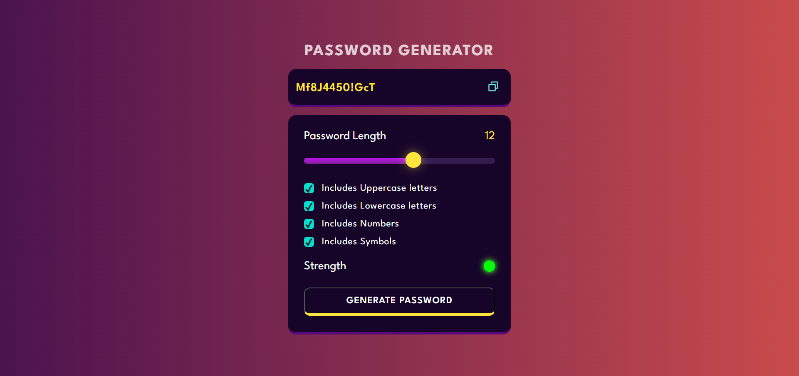
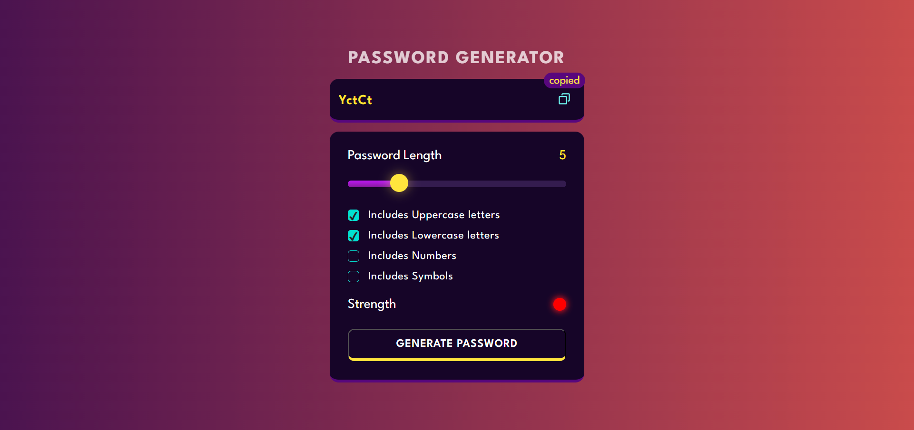

# Password-Generator using JS

Created a 'Random Password Generator' using HTML, CSS and JS.

## Project Screenshots

## Demo Link
[Live Link]()

## New Learnings 

- Writing function to generate random integer using Math.random()
- Writing function to generate random uppercase, lowercase, and symbol characters
- Calculating the strength of the generated password
- Copying generated password to the clipboard using Clipboard API
- Function to shuffle the generated password using 'Fisher Yates Algorithm'
- Adding custom CSS style properties to the slider, slider thumb, and checkboxes in Chrome as well as Firefox browser

  
